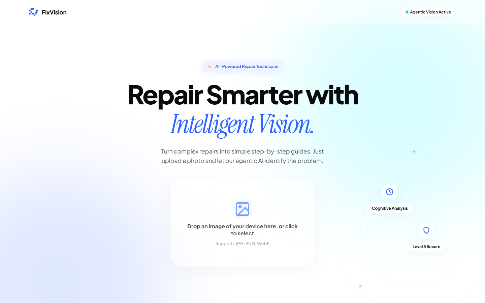
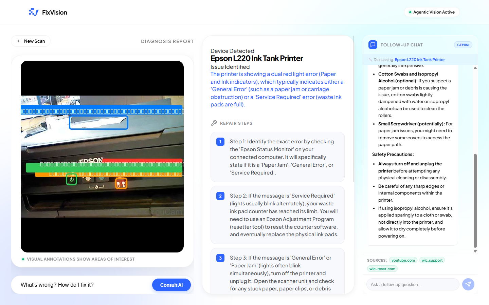
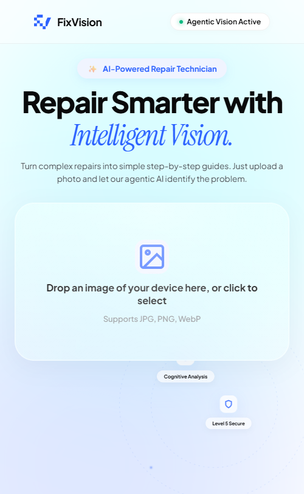

# FixVision AI 🔧🤖

> AI-powered repair assistant that analyzes photos of broken devices and generates step-by-step repair guides with visual annotations.



## ✨ Features

- **📸 Visual Device Analysis** — Upload a photo of your broken device (phone, laptop, appliance) and get instant diagnostics.
- **🔍 Google Search Grounding** — AI searches the web in real-time for the latest repair guides, error codes, and solutions.
- **📝 Step-by-Step Repair Guides** — Receive clear, actionable repair instructions with cited sources.
- **🎯 Visual Annotations** — Get an annotated image highlighting exactly where to focus.
- **💬 Follow-up Chat** — Ask follow-up questions using our AI chat powered by Gemini with real-time web search.

## 🚀 Live Demo

**[Try FixVision AI →](https://fixvision-ai-233122189624.asia-southeast1.run.app)**

## 🛠️ Tech Stack

| Layer | Technology |
|-------|------------|
| **Frontend** | Next.js 16, React 19, Framer Motion |
| **Styling** | Vanilla CSS with Glassmorphism design |
| **AI Engine** | Gemini 3 Flash (Agentic Vision + Google Search Grounding) |
| **Chat AI** | Gemini 2.0 Flash Lite with Google Search |
| **Image Processing** | Sharp.js for server-side annotation |
| **Deployment** | Google Cloud Run, Artifact Registry |
| **Runtime** | Bun + Node.js Alpine |

## 📸 Screenshots

| Desktop | Analysis | Mobile |
|---------|----------|--------|
|  |  |  |

## ⚡ Getting Started

### Prerequisites

- [Bun](https://bun.sh) (recommended) or Node.js 20+
- [Google AI API Key](https://aistudio.google.com/app/apikey)

### Installation

```bash
# Clone the repository
git clone https://github.com/dzakwanalifi/FixVision-AI.git
cd FixVision-AI

# Install dependencies
bun install

# Create environment file
cp .env.example .env.local
# Add your GEMINI_API_KEY to .env.local

# Run development server
bun dev
```

Open [http://localhost:3000](http://localhost:3000) to see the app.

## 🏗️ Project Structure

```
src/
├── app/
│   ├── api/
│   │   ├── analyze/     # Device analysis endpoint
│   │   └── chat/        # Follow-up chat endpoint
│   ├── page.tsx         # Main page
│   └── globals.css      # Global styles
├── components/
│   ├── ImageUploader    # Upload component
│   ├── AnnotatedImage   # Visual annotations
│   ├── RepairSteps      # Step-by-step guide
│   └── Chat             # Follow-up chat
└── lib/services/
    ├── gemini.ts        # Gemini AI integration
    └── image.ts         # Sharp.js image processing
```


## 👨‍💻 Author

**Dzakwan Alifi** — AI Engineer

## 📄 License

This project is open source and available under the [MIT License](LICENSE).

---

Built with ❤️ for the Orygn AI Open Hackathon
